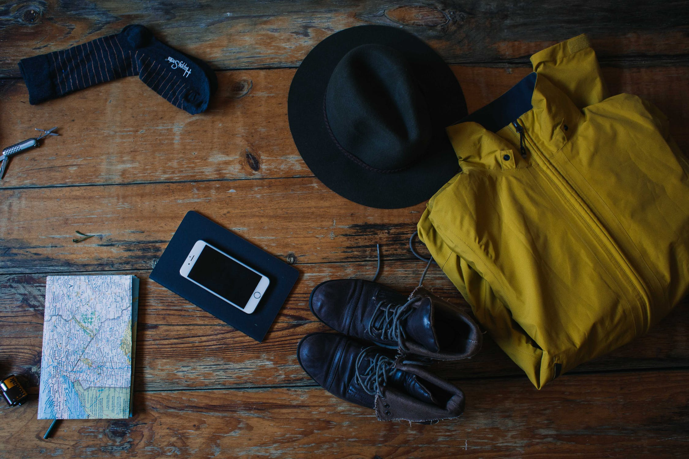

_One bag can be all you need to travel the world_. While the idea of one-bagging has been around for a long time, it has gained popularity in recent years owing to the growing community of travellers who share their experiences and tips for travelling with just one bag. With advancements in modern technologies, materials, and gear, one-bagging has become easier than ever. To delve into the [OneBag](https://www.reddit.com/r/onebag/) community's discussion on Reddit, let us explore how one-bagging can help you travel light, whether you are a seasoned traveller or just starting out, while still enjoying all that the world has to offer.

### Overview

- [Choosing the Right Bag for One-Bagging](#choosing-the-right-bag-for-one-bagging)
- [Packing Tips and Tricks for One-Bag Travel](#packing-tips-and-tricks-for-one-bag-travel)
- [Dressing for Success: Packing Light for Any Climate](#dressing-for-success-packing-light-for-any-climate)
- [Challenges and Benefits of One-Bagging as a Tourist](#challenges-and-benefits-of-one-bagging-as-a-tourist)
- [Challenges and Benefits of One-Bagging as a Family](#challenges-and-benefits-of-one-bagging-as-a-family)
- [One-Bagging for Adventure Travel: Packing for Outdoor Adventures and Active Trips](#one-bagging-for-adventure-travel-packing-for-outdoor-adventures-and-active-trips)
- [Personal Perspective of a Non-Frequent One-Bagging Traveler](#personal-perspective-of-a-non-frequent-one-bagging-traveler)

### Choosing the Right Bag for One-Bagging

Choosing the right bag is important for effective one-bagging. The best bags for one-bag travel are lightweight, versatile, and long-lasting. A member expressed a concern about his own backpack which had a manufacturing issue. After contacting the company, he was sent a new backpack free of charge under warranty. The post received comments from other members who shared their positive experiences with the brand along with questions about the manufacturer’s sustainability practices seeing that it did not last until warranty. The bag was a Cotopaxi which he used for two years travelling across California, Mexico, Sri Lanka, among others. See the discussion here, [Thank you Cotopaxi! Free bag replacement under warranty](https://www.reddit.com/r/onebag/comments/12ncbb0/thank_you_cotopaxi_free_bag_replacement_under/).

A contributor also shared thoughts on the prevalence of the Osprey Farpoint 40 backpack among one-bag travellers. ​​Some contributors expressed scepticism about the backpack's prevalence, intrigued wondering if it was because of aggressive marketing tactics rather than its actual performance. Others defended the backpack's reputation, owing to their personal positive experiences with it and the high ratings it has received from reputable reviewers. The most important factor when choosing a bag is to consider the type of trip you are planning, the length of your stay, and the items you will need to bring with you. Choose a bag with plenty of compartments and organisational features to keep your belongings neat and easy to access. See the discussion here, [I feel like the Osprey marketing team is on this subreddit, suggesting and upvoting the Farpoint 40](https://www.reddit.com/r/onebag/comments/130xdty/i_feel_like_the_osprey_marketing_team_is_on_this/).

### Packing Tips and Tricks for One-Bag Travel

In a Reddit post [8 Months of traveling South-america 40L](https://www.reddit.com/r/onebag/comments/1390caq/8_months_of_traveling_southamerica_40l/), a participant shared their experience of efficiently one-bagging an eight(8)-month trip through South America with a 40 L backpack. This allowed them to navigate their journey smoothly, eliminating the hassle of checking in additional luggage at airports. The participant offered valuable tips on efficient packing, including the use of packing cubes and rolling clothes to maximise space. Despite carrying electronic devices such as a Kindle and a camera, they maintained a minimalist approach to their packing. Furthermore, the participant emphasised the importance of adaptability and flexibility to unexpected situations. Being prepared to adjust plans and stay open-minded can greatly enhance the overall experience. It is crucial to remain mindful of airline restrictions on liquids and other items. By following these guidelines, travellers can minimise potential hassles and enjoy a more streamlined journey.

### Dressing for Success: Packing Light for Any Climate

Regardless of whether you are travelling to a hot or cold climate, one-bagging requires careful consideration of materials you will need to stay comfortable. Invest in garments that will help you stay prepared for any weather. Provide lightweight, breathable clothing for hot climates and opt for wool or fleece for colder destinations. A fellow member packed minimal and lightweight clothing, including merino wool underwear, wool t-shirts, and a waterproof jacket to account for varying temperatures and weather conditions. He also carried a book, a smartphone, and a small toiletry bag. The fellow realised the 15 L backpack to be convenient and comfortable for the trip, allowing him to move around easily without worrying about heavy luggage. He also emphasised that the small size of the backpack helped him pack only the essentials, avoiding overpacking. See the discussion here, [15 L, two weeks in Switzerland and Italy, -2°C to 22°C](https://www.reddit.com/r/onebag/comments/12w49vs/15_l_two_weeks_in_switzerland_and_italy_2c_to_22c/).

In a Reddit post [One-bag for 2 weeks in Europe](https://www.reddit.com/r/onebag/comments/1388g6t/onebag_for_2_weeks_in_europe/), another fellow member shared their experience of one-bagging for a two(2)-week trip in Europe. They used a 35 L backpack and packed versatile clothing items such as merino wool shirts and pants, a lightweight down jacket, and a pair of comfortable walking shoes. They also included travel essentials such as a microfiber towel, a universal power adapter, and a water bottle. They managed their laundry once during their trip, which was convenient and easy due to the quick-drying properties of their clothing.

### Challenges and Benefits of One-Bagging as a Tourist

A user concerned the challenge of maintaining a non-touristy appearance while practising one-bagging during travel. This is because tourists often become easy targets for theft or scams, making it necessary to blend in with the local surroundings for a safer travel experience. One-bagging can contribute to achieving this by enabling a minimalist and practical wardrobe that aligns with the local culture and climate. The advantages of not looking like a tourist encompass the ability to immerse oneself in a more authentic travel experience and being treated as a local by the locals. Additionally, it can lead to potential cost savings, as vendors may be less inclined to overcharge someone who appears to be a local resident. See the discussion here, [Not looking like a tourist](https://www.reddit.com/r/onebag/comments/134c5jl/not_looking_like_a_tourist/).

### Challenges and Benefits of One-Bagging as a Family

In a Reddit post [Family of three, onebagging in Japan](https://www.reddit.com/r/onebag/comments/12xozab/we_47m_and_48f_took_our_youngest_14f_to_japan_for/), a member pointed out that we can learn several things as a family that practises one-bagging. Alot ample time to plan packing lists and choose versatile clothing items that can be mixed and matched. Also make sure to bring essential items for specific activities, such as swimwear and hiking shoes. Use packing cubes to organise belongings within the single backpack, making it easier to find what is needed and keep their bag tidy. The family was able to travel comfortably and efficiently with just one backpack per person, without worrying about bulky luggage. They were also able to save money on baggage fees and avoid the hassle of waiting for checked luggage at the airport. Overall, we can learn that with careful planning, efficient packing techniques, and a willingness to embrace a minimalist travel lifestyle, families can successfully practise one-bagging and enjoy the many benefits that come with it.

### One-Bagging for Adventure Travel: Packing for Outdoor Adventures and Active Trips

A participant imparted his experience of embarking on a one(1)-month road trip in New Zealand with just one backpack. He discussed the comprehensive packing list, including versatile clothing suitable for various weather conditions, and essential camping gear. Despite experiencing challenges like adjusting to unpredictable weather and finding accommodations in remote areas, he also experienced several benefits. These included the opportunity of easy mobility, the embrace of a simple and minimalistic lifestyle, and a profound sense of independence. He concluded the post by offering helpful tips and recommendations for others planning similar trips, emphasising the importance of efficient packing, renting suitable vehicles, and staying open to unexpected experiences. See the discussion here, [One Month Road Trip in New Zealand](https://www.reddit.com/r/onebag/comments/139ijn2/one_month_road_trip_in_new_zealand/). 

### Personal Perspective of a Non-Frequent One-Bagging Traveler

In a Reddit post [Confession: I don&#39;t travel much, but I lurk here to discover items/strategies that help consolidate my home life](https://www.reddit.com/r/onebag/comments/131xnri/confession_i_dont_travel_much_but_i_lurk_here_to/), an individual who does not consider themselves a frequent traveller shared their experience of discovering inspiration within the one-bagging community. The post received an array of responses: the community serves as a valuable source of inspiration and ideas for those seeking to travel light and simplify their journey; the sustainability surfaces as an important aspect, with community members perceiving the environmental benefits of reducing waste and adopting a minimalist approach; and the accessibility of one-bagging stands out, as the community welcomes individuals of all travel backgrounds, offering practical tips and advice that can be applied regardless of budget or destination. This personal perspective provides valuable insights into the world of one-bagging, showing its appeal beyond frequent travellers.

With that, we are calling all travellers! Revolutionise the way you travel by joining our vibrant one-bag community. Let your journey shape the way you explore the world. Pack your essentials, clear your mind, and embark on the ultimate travel of a lifetime. Together, let us redefine the art of travel and embrace the beauty of one bagging. Join us now to share your invaluable tips, seek advice, and be captivated by the incredible stories of fellow one-baggers. Unleash your wanderlust and let the one-bag movement ignite your spirit of adventure.

### Want More?
Here are a couple of ideas for you:
- [Trip report on iPhone 14 satellite location sending](https://www.reddit.com/r/Ultralight/comments/134r8uq/trip_report_on_iphone_14_satellite_location/)
- [EU charger weight dump](https://www.reddit.com/r/Ultralight/comments/12ypu5j/eu_charger_weight_dump/)
- [Predicting Snow Conditions: Tools and Strategies for Planning Outdoor Adventures](https://www.reddit.com/r/Ultralight/comments/137vbty/snow_guide/)
- [Airbnb will now tell you about any annoying checkout chores a host requires before you book — and take off listings that get low reviews for chore lists](https://www.businessinsider.com/airbnb-taking-action-annoying-checkout-chores-cleaning-rating-2023-5)
- [Feels like we&#39;ve all met this guy abroad](https://www.reddit.com/r/digitalnomad/comments/135534h/feels_like_weve_all_met_this_guy_abroad/)
- [Working from Tokyo for Company on U.S. Eastern Time - A Review](https://www.reddit.com/gallery/135yt9z)

### That is all, isn't it?
Whether you have explored bustling cities, trekked through dense jungles, or traversed vast deserts, your experiences hold immense value. Hence, gather your thoughts, recall your fondest memories, and get ready to inspire others with your one-bagging stories by posting through our public discussion below. You may contact us here, [contact form](https://www.packingpanic.com/contact-us).