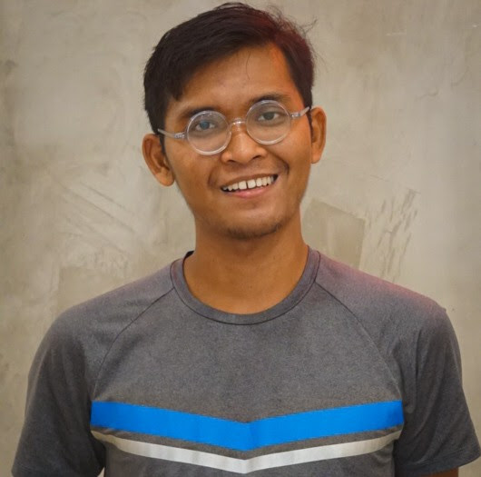

### You?!

Do you like travelling? We are looking for co-founders and team mates!

### Jens Wilke

    <a href="https://twitter.com/cruftex" target="_blank" rel="noopener noreferrer me" title="Twitter">
        <svg xmlns="http://www.w3.org/2000/svg" viewBox="0 0 24 24" fill="none" stroke="currentColor" stroke-width="2" stroke-linecap="round" stroke-linejoin="round">
            <path d="M23 3a10.9 10.9 0 0 1-3.14 1.53 4.48 4.48 0 0 0-7.86 3v1A10.66 10.66 0 0 1 3 4s-4 9 5 13a11.64 11.64 0 0 1-7 2c9 5 20 0 20-11.5a4.5 4.5 0 0 0-.08-.83A7.72 7.72 0 0 0 23 3z">
            </path>
        </svg>
    </a>
    <a href="https://linkedin.com/in/cruftex" target="_blank" rel="noopener noreferrer me" title="LinkedIn">
        <svg xmlns="http://www.w3.org/2000/svg" viewBox="0 0 24 24" fill="none" stroke="currentColor" stroke-width="2" stroke-linecap="round" stroke-linejoin="round">
            <path d="M16 8a6 6 0 0 1 6 6v7h-4v-7a2 2 0 0 0-2-2 2 2 0 0 0-2 2v7h-4v-7a6 6 0 0 1 6-6z"></path>
            <rect x="2" y="9" width="4" height="12"></rect>
            <circle cx="4" cy="4" r="2"></circle>
        </svg>
    </a>

Although based in Munich, since 2015 mostly travelling and working from remote sites. Jens is a seasoned software engineer and runs his own boutique software shop since 1994, mostly doing consulting. He likes long distance hiking and has walked the West Highland Way and the Camino and also cycled on the Highway 1 in California from San Diego to San Francisco. He is constantly minimizing and optimizing his luggage and never leaves home without a scale and a meter.

### Bakhrul "Bayu" Ulum

  

    <a href="https://twitter.com/bakhrululum19" target="_blank" rel="noopener noreferrer me" title="Twitter">
        <svg xmlns="http://www.w3.org/2000/svg" viewBox="0 0 24 24" fill="none" stroke="currentColor" stroke-width="2" stroke-linecap="round" stroke-linejoin="round">
            <path d="M23 3a10.9 10.9 0 0 1-3.14 1.53 4.48 4.48 0 0 0-7.86 3v1A10.66 10.66 0 0 1 3 4s-4 9 5 13a11.64 11.64 0 0 1-7 2c9 5 20 0 20-11.5a4.5 4.5 0 0 0-.08-.83A7.72 7.72 0 0 0 23 3z"></path>
        </svg>
    </a>
    <a href="https://linkedin.com/in/bakhrululum19" target="_blank" rel="noopener noreferrer me" title="LinkedIn">
        <svg xmlns="http://www.w3.org/2000/svg" viewBox="0 0 24 24" fill="none" stroke="currentColor" stroke-width="2" stroke-linecap="round" stroke-linejoin="round">
            <path d="M16 8a6 6 0 0 1 6 6v7h-4v-7a2 2 0 0 0-2-2 2 2 0 0 0-2 2v7h-4v-7a6 6 0 0 1 6-6z"></path>
            <rect x="2" y="9" width="4" height="12"></rect>
            <circle cx="4" cy="4" r="2"></circle>
        </svg>
    </a>

Bakhrul is an Engineering Graduate who transitioned into digital marketing in 2021. In September 2022, he left his full-time job to pursue his passion 
for travel and nomadic living. An adventure seeker at heart, Bakhrul enjoys embarking on challenging trips such as a 23-hour train ride in India 
from Jaisalmer to New Delhi, a 26-hour bus ride from Hanoi, Vietnam to Luang Prabang, Laos, and a month-long cycling trip from Bangkok, Thailand to Cirebon, Indonesia. 
With years of backpacking experience, he is constantly optimizing his luggage for maximum efficiency while on the go.
